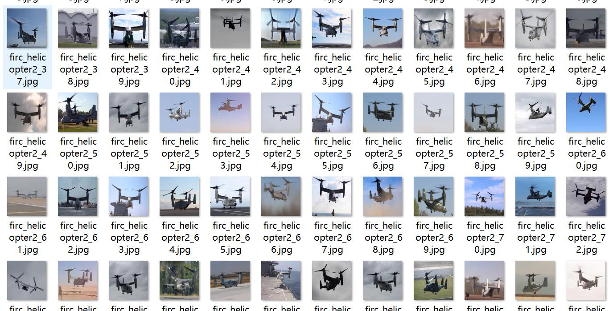
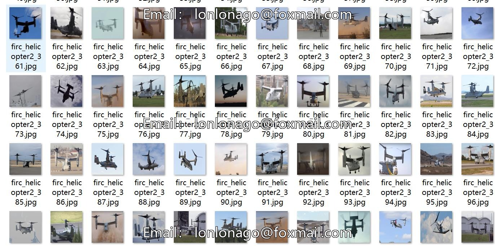
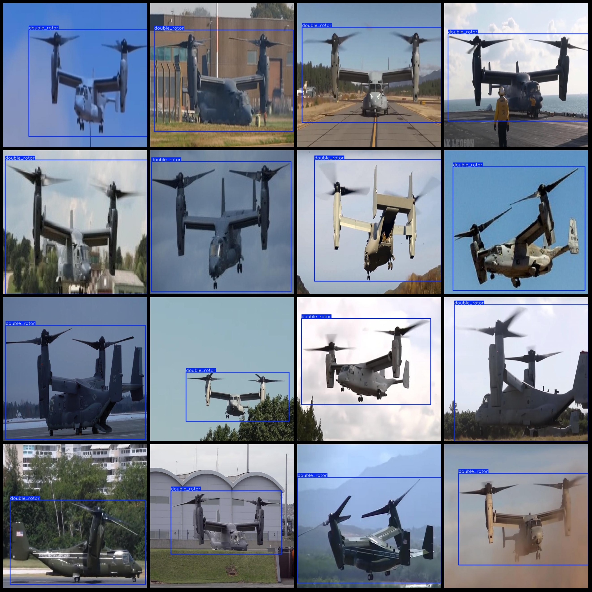
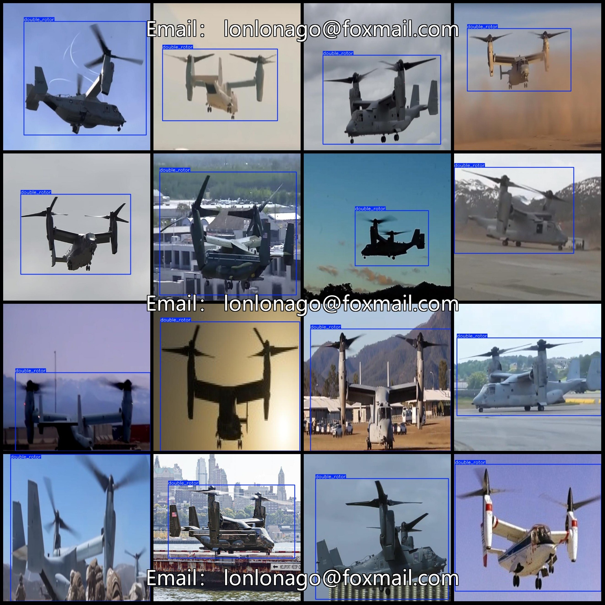

# Double-rotor helicopter detection dataset in VOC+YOLO format with 1118 images and 1 class

Dataset format: Pascal VOC format + YOLO format (txt file without split path, only contains jpg images and corresponding VOC format xml files and yolo format txt files)
Number of images (jpg file count): 1118.
Number of xml files: 1118.
Number of txt files: 1118
annotationnumber of classes: 1  
"double_rotor"
Number of boxes labeled in each category:
double_rotor box count = 1118  
Total frames: 1118
Image resolution: 640x640
Use annotation tool: labelImg  
Annotation rules: draw a rectangle around the class  
Important notes: None
Special Disclaimer: This dataset does not guarantee the accuracy of the trained models or weight files.
Image preview:
## Images

Here is a pay link on Stripe ( https://buy.stripe.com/3cs8yP7sY87d0vu9AB ). Please contact me lonlonago@foxmail.com after funding $89, and I will send you a complete data files , thank you!

